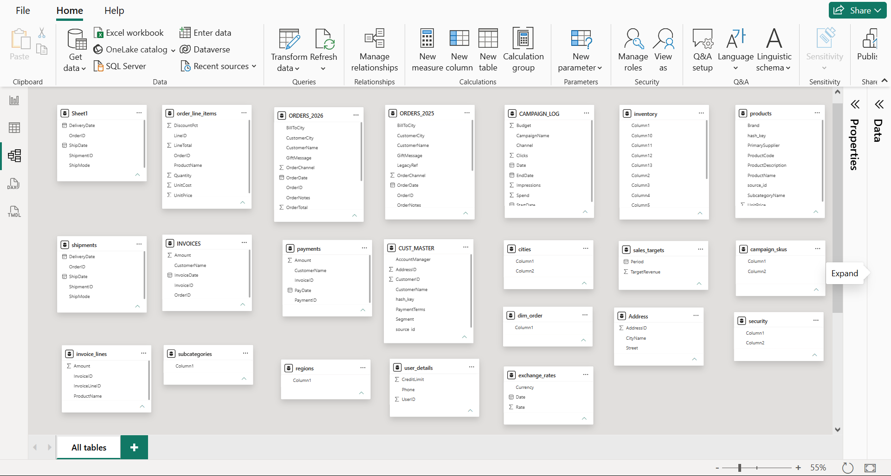
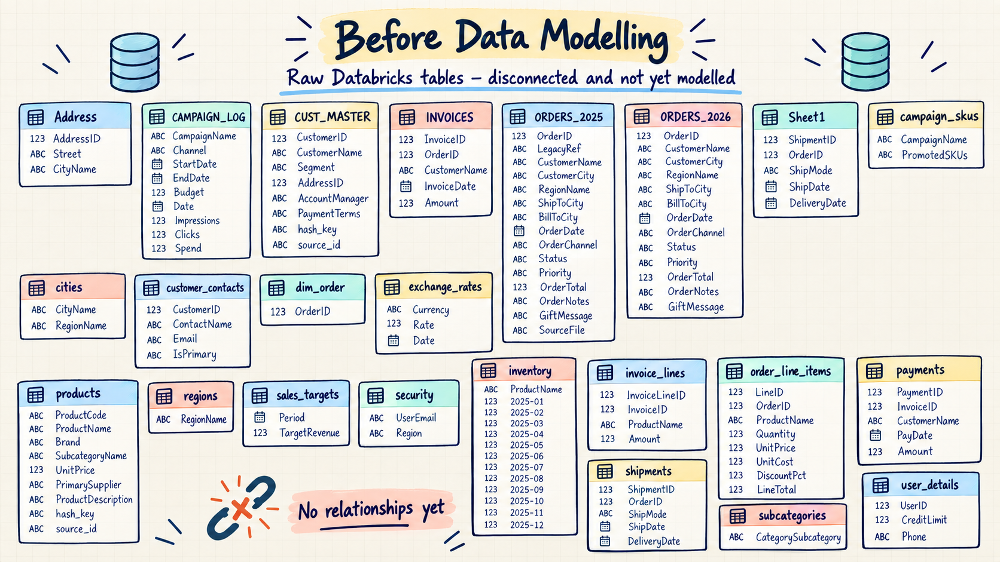
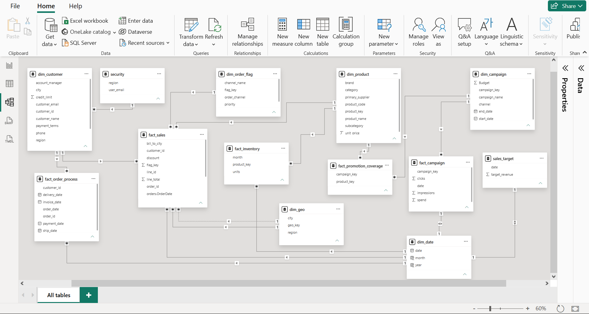
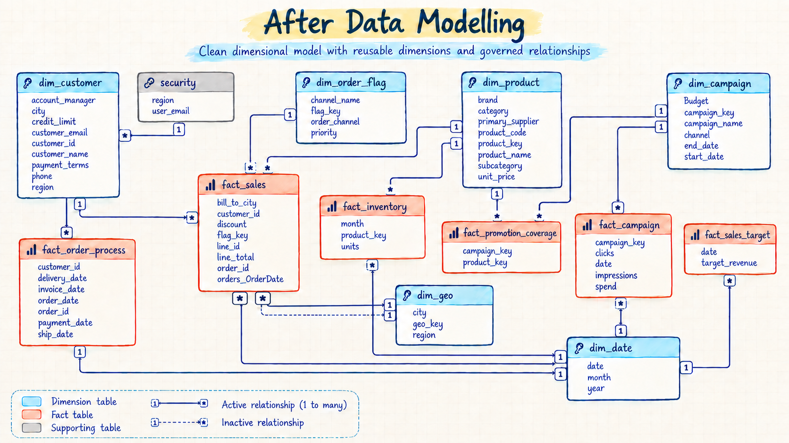

# 📊 Data Modeling in Power BI

## **A real-world Power BI data-modeling project based on challenges and solutions I have handled in professional BI work, recreated with simulated data.**

### **It demonstrates the same end-to-end approach I use to turn fragmented operational data into accurate reporting, scalable analysis, and secure regional access.**

<div align="center">


### From disconnected operational tables to a governed, analysis-ready dimensional model

**Reliable numbers · Faster report development · Reusable dimensions · Regional data security**

[Download the Power BI project](power-bi/Power_BI_Data_Modeling_Project.pbix) · [View the final model](assets/power-bi-after-modeling.png)

</div>

---

## 🎯 Executive summary

| Business problem | Solution delivered | Business value |
|---|---|---|
| Sales, orders, invoices, inventory, campaigns, and customer data were fragmented across inconsistent source tables. | Audited, cleaned, merged, appended, reshaped, keyed, and validated the data before redesigning it as a governed dimensional model. | Users receive trusted metrics, analysts build reports faster, and BI teams gain a model that is easier to test, secure, maintain, and extend. |

### At a glance

| ⭐ Model | 📈 Analysis | 🔐 Governance | ✅ Quality |
|---|---|---|---|
| **6 dimensions** and **6 fact tables** | Sales, orders, inventory, campaigns, promotions, and targets | Dynamic regional row-level security | Grain, totals, cardinality, and filter paths validated |

---

## 🔄 Transformation: before → after

### ❌ Before — disconnected source tables

Inconsistent names, duplicated entities, mixed grains, and no dependable relationship structure made reporting difficult to trust.

**Real Power BI model view**



**Source-table architecture diagram**



### ✅ After — governed dimensional model

Reusable dimensions, clearly defined facts, one-to-many relationships, and controlled filter direction created a dependable semantic layer.

**Real Power BI model view**



**Final dimensional-model diagram**



---

## 💼 The business challenge

The source structure made even basic questions difficult to answer confidently:

- Are sales totals correct, or are relationships duplicating transactions?
- How many customers are actively ordering?
- How long does an order take to move from placement to payment?
- Are campaigns producing engagement across the intended products?
- How do actual sales compare with monthly targets?
- Can regional users be restricted to only the data they are authorized to see?

### Risks in the original model

| Risk | Business impact |
|---|---|
| **Mixed table grains** | Incorrect totals and silent duplication |
| **Disconnected and duplicated entities** | Conflicting customer, product, and location views |
| **Technical and inconsistent naming** | Slow report development and difficult handover |
| **Uncontrolled filter paths** | Ambiguous calculations and unpredictable reports |
| **No governed security layer** | Users could receive inappropriate regional visibility |

---

## 💡 The solution

```text
Raw operational tables
        ↓
Power Query cleanup and consolidation
        ↓
Conformed dimensions + business-process facts
        ↓
Governed relationships + reusable DAX measures
        ↓
Validated, secure semantic model for reporting
```

| What was built | Why it matters |
|---|---|
| **Clearly defined fact-table grains** | Protects totals and prevents accidental duplication |
| **Shared customer, product, date, geography, campaign, and order dimensions** | Creates consistent slicing across business processes |
| **Single-direction, one-to-many relationships** | Produces predictable filter behavior |
| **Surrogate keys and `snake_case` naming** | Improves consistency, readability, and maintainability |
| **Centralized DAX measures** | Gives every report the same business logic |
| **Dynamic regional row-level security** | Restricts data based on the signed-in user |
| **Incremental validation checks** | Detects broken totals before changes reach reports |

---

## 🛠️ Engineering work completed

> This project was not a relationship-layout exercise. The final model was built through extensive Power Query transformation, grain analysis, data-quality correction, dimensional design, and validation.

### 1️⃣ Prepared and governed the transformation layer

- Organized queries into **staging, dimensions, facts, and support** groups.
- Created **references from raw queries** so source logic remained untouched and reusable.
- Disabled load for intermediate/staging queries that should not enter the semantic model.
- Removed duplicate imports, obsolete queries, and a non-analytical order-ID table.
- Standardized tables and columns using `snake_case`, `dim_`, `fact_`, `_id`, and `_key` conventions.

### 2️⃣ Built conformed dimensions from fragmented sources

| Dimension | Transformation work |
|---|---|
| **Customer** | Filtered contacts to the primary contact before merging; joined customer, contact, user-detail, address, city, and region data; promoted headers; preserved one-row-per-customer grain; removed technical hashes, source fields, redundant IDs, and unused attributes. |
| **Product** | Validated uniqueness; split category/subcategory values by delimiter; standardized text casing for reliable joins; merged category mappings; corrected duplicate product names; created `product_key`; removed source-system noise. |
| **Order flag** | Extracted reusable order descriptors from transaction data; removed duplicates; enriched coded channels with friendly names; created `flag_key`. |
| **Geography** | Extracted unique city-region combinations; removed duplicates; created `geo_key`; replaced repeated city text in the fact with role-based geography keys. |
| **Campaign** | Separated descriptive campaign attributes from daily performance events; removed duplicates; created `campaign_key`. |
| **Date** | Generated a reusable calendar, added month/year attributes, marked it as the model's date table, and governed active versus inactive date relationships. |

### 3️⃣ Reshaped and assembled analytical facts

| Fact | Transformation work |
|---|---|
| **Sales** | Appended 2025 and 2026 order sources; reconciled schema differences; merged order headers with line items; added customer, product, flag, and geography keys; removed duplicated descriptive fields and untrusted pre-aggregated totals; preserved line-level grain. |
| **Order process** | Combined orders, shipments, invoices, and payments into one order-level lifecycle containing order, ship, delivery, invoice, and payment dates. |
| **Inventory** | Promoted headers and **unpivoted monthly columns into rows**, producing product-month-unit records; replaced product names with model keys. |
| **Campaign** | Split the campaign log into descriptive and transactional structures; retained daily clicks, impressions, and spend at the correct grain. |
| **Promotion coverage** | Promoted headers, split comma-separated SKU lists **into rows**, trimmed values, and mapped campaign/product keys to create a factless bridge. |
| **Sales target** | Converted monthly target data into a clean date-and-revenue fact for actual-versus-target analysis. |

### 4️⃣ Protected data quality throughout the build

- Checked merge cardinality before combining tables and used **left joins** to avoid dropping business entities.
- Used `Group By` row counts and distinct-key checks to detect duplicates and fan-out.
- Filtered one-to-many contact data before merging it into the customer dimension.
- Tracked key measures during fact-table merges to catch silent changes in totals.
- Corrected duplicate product records that caused sales values to multiply.
- Replaced descriptive attributes in facts with surrogate keys only after validating lookup coverage.
- Re-tested totals, relationship direction, fact grain, and security behavior before handover.

### 5️⃣ Added the reporting and security layer

- Centralized reusable DAX measures for total sales, distinct orders, active customers, total customers, and average order-to-payment duration.
- Applied number formatting and disabled inappropriate default summarization.
- Created dynamic regional RLS using the signed-in user's identity.
- Tested the security role with representative users and verified its effect on dimensions and facts.

---

## 🏗️ Model architecture

| Dimensions | Business purpose |
|---|---|
| `dim_customer` | Customer, account, contact, location, and payment context |
| `dim_product` | Product, brand, category, supplier, and pricing context |
| `dim_date` | Shared calendar for consistent time analysis |
| `dim_geo` | Reusable city and region mapping |
| `dim_campaign` | Campaign, channel, budget, and schedule context |
| `dim_order_flag` | Order channel and priority classification |

| Facts | Grain / analytical purpose |
|---|---|
| `fact_sales` | One row per order line; sales, quantity, cost, and discount analysis |
| `fact_order_process` | One row per order; lifecycle from order through payment |
| `fact_inventory` | Monthly units by product |
| `fact_campaign` | Daily campaign clicks, impressions, and spend |
| `fact_promotion_coverage` | Campaign-to-product promotion coverage |
| `fact_sales_target` | Revenue target by date |

> `security` maps users to regions and propagates authorized access through `dim_customer` to the relevant facts.

---

## 👥 How it helps users

| Audience | Outcome |
|---|---|
| **Business users** | Explore trusted sales, customer, product, inventory, campaign, and target metrics without understanding source-system complexity. |
| **Analysts & report developers** | Build visuals faster using friendly dimensions and reusable measures instead of rebuilding joins and calculations. |
| **Managers** | Compare actuals with targets and monitor the complete order-to-payment lifecycle from one model. |
| **BI & data teams** | Refresh, test, troubleshoot, secure, extend, and hand over the model more confidently. |

---

## ✅ Validation & governance

- Verified row counts and declared the grain of every fact.
- Used distinct-order checks where the physical table grain is order line.
- Reviewed relationship cardinality and filter direction.
- Reconciled business totals after each major transformation.
- Retained only intentional inactive date and geography relationships.
- Tested regional security with representative users.

---

## 🧰 Skills demonstrated


### 📐 Data modeling & architecture

- ⭐ **Dimensional modeling** — designed a reusable star-schema-style semantic layer
- 🔵 **Dimension design** — customer, product, date, geography, campaign, and order flags
- 🔴 **Fact-table design** — sales, order process, inventory, campaigns, promotions, and targets
- 🎯 **Grain definition** — declared what every fact row represents before creating relationships
- 🔑 **Surrogate keys** — introduced stable model keys with consistent `_key` naming
- 🔗 **Relationship design** — managed cardinality, filter direction, and intentional inactive relationships

### ⚙️ Transformation & business logic

- 🧹 **Power Query** — referenced, filtered, merged, appended, expanded, split, trimmed, deduplicated, grouped, and unpivoted source data
- 🧮 **DAX** — created centralized measures and row-level calculations
- 📅 **Date modeling** — built a shared calendar for consistent time analysis
- 🏷️ **Naming standards** — applied readable `snake_case`, `dim_`, and `fact_` conventions
- 🧩 **Multi-fact modeling** — integrated several business processes without direct fact-to-fact joins
- 🧱 **Factless-fact modeling** — resolved the campaign-to-product many-to-many process through promotion coverage
- 📊 **Semantic model design** — exposed business-friendly fields instead of technical source structures

### ✅ Quality, performance & governance

- 🛡️ **Dynamic row-level security** — restricted regional data using the signed-in user
- 🔍 **Data validation** — reconciled totals, row counts, distinct orders, and relationship behavior
- 🚦 **Model governance** — controlled filter paths and removed ambiguous relationships
- ⚡ **Model optimization** — removed unnecessary columns and reporting-irrelevant technical fields
- 📚 **Documentation** — communicated the business problem, architecture, decisions, and user value

---

## 🚀 Explore the project

1. Download [`Power_BI_Data_Modeling_Project.pbix`](power-bi/Power_BI_Data_Modeling_Project.pbix).
2. Open it in **Power BI Desktop**.
3. Review the Power Query transformations, model relationships, measures, and security role.

```text
Data_Modeling-in-Power-BI/
├── assets/     # Real Power BI screenshots and architecture diagrams
├── power-bi/   # Completed PBIX project
└── README.md
```

> The repository contains the completed Power BI file and model documentation. Original raw data files are intentionally excluded.
